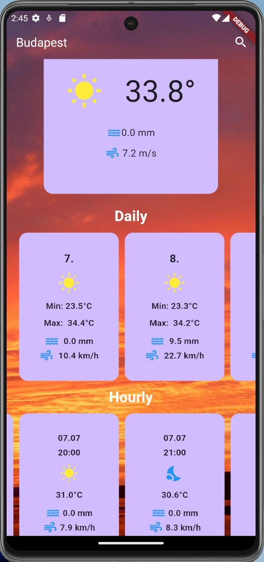
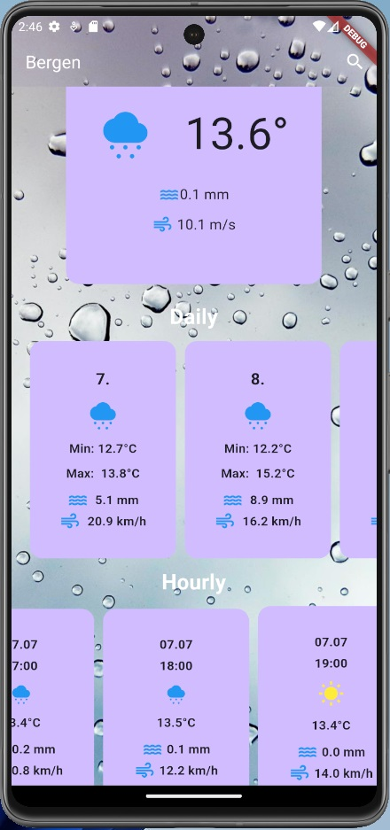

# Weather Application 

[OpenMeteo](https://open-meteo.com/)

It starts with a starting screen where you can enter the name of a city. If a valid city name is found during the request, it displays the daily and hourly weather. If nothing is entered, an error is shown and it won't allow you to proceed. If an invalid name is entered, an error message is displayed. A modal window is included if you want to request weather data for another city. The weather icons and background images adapt to the weather conditions.

## Screenshots

